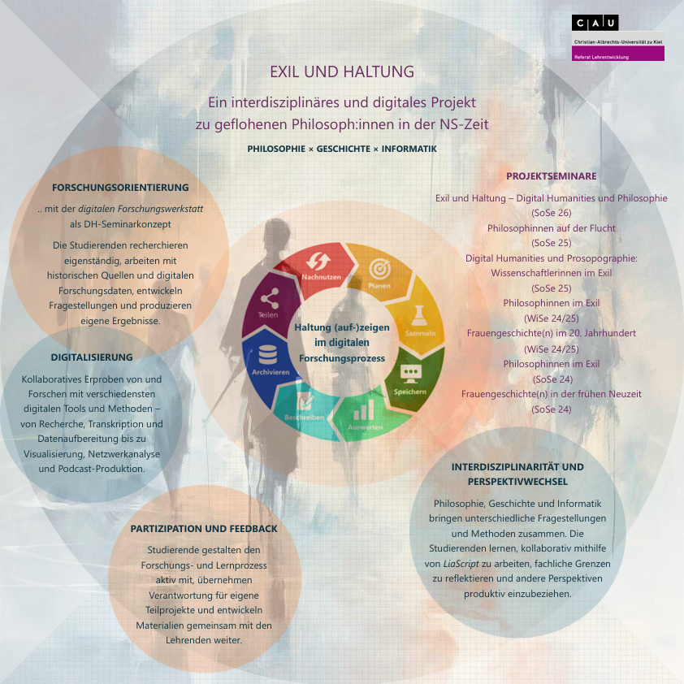
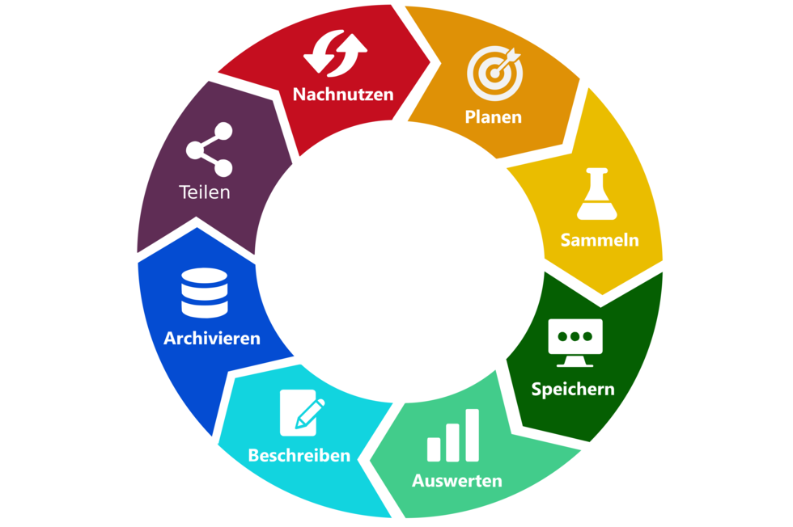
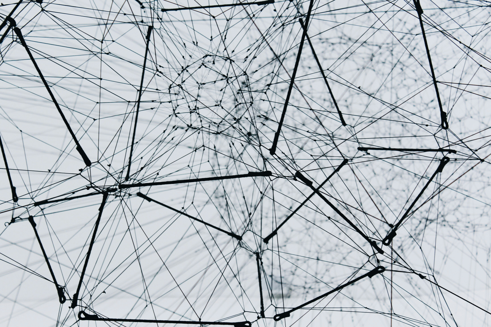
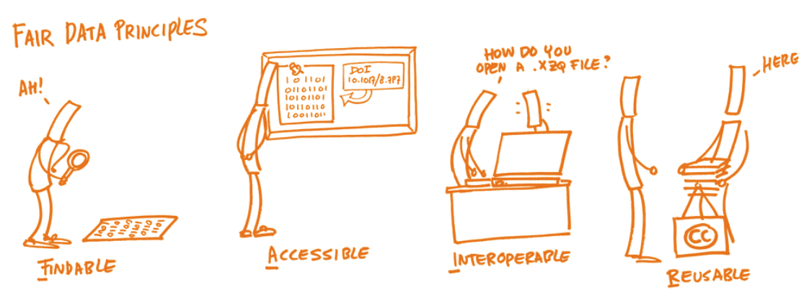
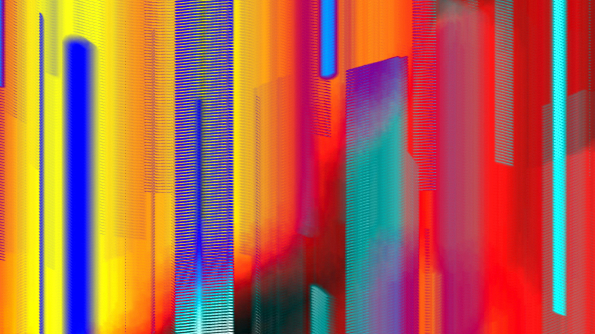
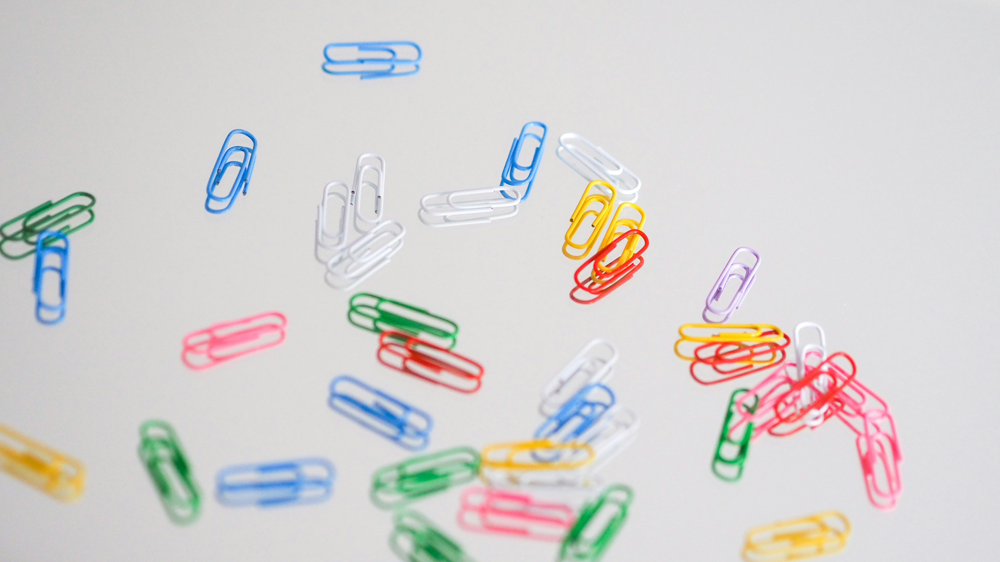
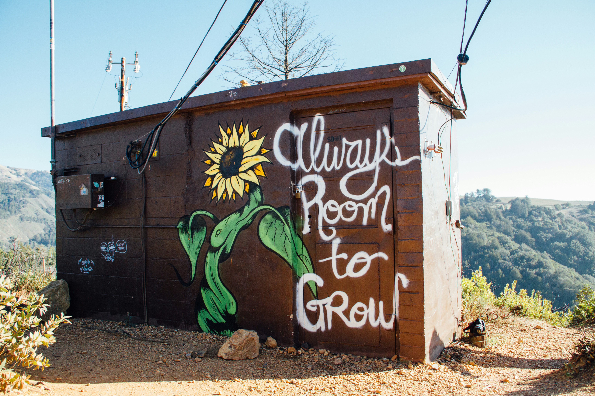

<!--
author:   Aina-Jula Stehr

email:    stu223341@mail.uni-kiel.de

version:  0.0.1

language: en

narrator: US English Female

-->

# Haltung (auf-)zeigen: Ein interdisziplinäres Lehrprojekt

 Moin. :-) Dieser Kurs dient als überblickgebende Führung durch die Forschungsmethoden, -tools und -ergebnisse eines interdisziplinären DH-Lehrprojekts der CAU Kiel, welches in Form von interaktiven **digitalen Forschungswerkstätten** umgesetzt wird. 
**HINWEIS**: Die Links zu einzelnen Kursen leiten Sie jeweils zu dem entsprechenden GitHub Repository weiter. Um sich den Kurs formatiert in LiaScript anzeigen zu lassen, kopieren Sie die Markdown-URL [hier](https://liascript.github.io/) in das vorgesehene Feld.

 

# Warum digitale Forschungswerkstätten?

Philosophisches Denken vollzieht sich nicht im luftleeren Raum. Es entsteht im Gespräch, im gemeinsamen Fragen und in der Auseinandersetzung mit Quellen, Menschen und unterschiedlichen Perspektiven. Wo historische Brüche, Exil oder gesellschaftliche Ausgrenzung Stimmen aus dem wissenschaftlichen Gedächtnis verdrängt haben, beginnt Forschung auch mit der Aufgabe, diese Stimmen wieder sichtbar und hörbar zu machen.

Eine digitale Forschungswerkstatt verstehen wir deshalb nicht als bloße Sammlung digitaler Werkzeuge. Sie ist ein Raum gemeinsamen Forschens, in dem Erkenntnis Schritt für Schritt entsteht – im Fragen, Suchen, Erproben, Verwerfen und Weiterdenken. Studierende werden dabei nicht nur zu Lernenden, sondern zu Mitforschenden: Sie recherchieren, transkribieren, annotieren, modellieren, visualisieren und veröffentlichen ihre Ergebnisse. Digitale Methoden eröffnen neue Möglichkeiten, Quellen zu erschließen, Zusammenhänge sichtbar zu machen und Forschung zugänglich zu halten.


Zugleich ist die Forschungswerkstatt ein Raum, in dem sich Haltung zeigt. Denn Forschung beginnt nicht erst mit ihren Ergebnissen. Sie zeigt sich bereits darin, welche Fragen wir stellen, welche Stimmen wir berücksichtigen, wie wir mit Quellen umgehen, Daten erheben, ordnen, interpretieren und schließlich mit anderen teilen. Jede dieser Entscheidungen bringt uns in ein Verhältnis – zu den Quellen, zu den erforschten Personen, zu unseren Mitforschenden und nicht zuletzt zu uns selbst. 
Haltung bezeichnet dabei keinen feststehenden Standpunkt. Sie entsteht im Vollzug: als eine Weise, Stellung zu beziehen und sich zugleich offen zu halten für das, was sich im Gegenüber, in der Quelle oder im gemeinsamen Denken zeigt. Sie ist Standpunkt und Beweglichkeit zugleich. Gerade die digitale Forschungswerkstatt macht diese Spannung erfahrbar, weil Forschung hier nicht als linear vorgegebener Ablauf, sondern als gemeinsamer Prozess des Werdens verstanden wird.

Dies gilt in besonderer Weise für die Zusammenarbeit von Geschichte, Philosophie und Informatik. Unterschiedliche fachliche Zugänge, Begriffe und Methoden treffen aufeinander, ohne in einer gemeinsamen Sprache aufzugehen. Gerade diese Differenz kann produktiv werden: im Austausch, in der Irritation, im gegenseitigen Fragen und in der Bereitschaft, die eigene Perspektive verändern zu lassen, ohne sie aufzugeben. Interdisziplinäres Forschen wird so zu einer Praxis des Gesprächs.


Die digitalen Werkzeuge unterstützen diesen Prozess, indem sie gemeinsames Arbeiten ermöglichen, Entscheidungen dokumentierbar machen und Forschung über den konkreten Entstehungsmoment hinaus zugänglich und anschlussfähig halten. Aus dem gemeinsamen Arbeiten entstehen dabei nicht nur Forschungsergebnisse, sondern auch fachübergreifend nutzbare Lehrmaterialien und Open Educational Resources. 
Die einzelnen Phasen der digitalen Projektarbeit werden in diesem Kurs daher nicht allein als technische Arbeitsschritte verstanden. Sie sind zugleich Gelegenheiten, wissenschaftliche Haltung praktisch zu erproben: Verantwortung zu übernehmen, aufmerksam zu fragen, sorgfältig mit Quellen und Daten umzugehen, die eigene Perspektive zu reflektieren, Unterschiede auszuhalten und Forschung als ein offenes, gemeinsames Gespräch weiterzuführen.
Die digitale Forschungswerkstatt ist damit ein Zwischenraum: zwischen Personen, Disziplinen, Sprachen, Quellen und Technologien. Ihr Ziel ist nicht, Differenzen aufzuheben, sondern ihnen Raum zu geben und daraus gemeinsames Denken entstehen zu lassen. Haltung wird hier nicht nur zum Gegenstand philosophischer Reflexion. Sie wird in der Weise, wie wir forschen, miteinander arbeiten und aufeinander antworten, selbst zur Praxis. 

# Haltung im Forschungsprozess

 Forschung beginnt nicht erst mit dem Ergebnis. Sie beginnt dort, wo wir fragen, auswählen und uns zu etwas ins Verhältnis setzen. Jede Entscheidung im Forschungsprozess – von der Formulierung einer Frage über den Umgang mit Quellen und Daten bis hin zu ihrer Interpretation und Veröffentlichung – trägt eine Haltung in sich. Haltung zeigt sich deshalb in der Weise, wie wir forschen: In unserer Aufmerksamkeit für das, was sichtbar und unsichtbar bleibt, in der Sorgfalt unseres Umgangs mit Quellen, in der Reflexion der eigenen Perspektive und in der Bereitschaft, das eigene Verständnis im Gespräch mit anderen zu verändern. Sie bedeutet, Verantwortung für das eigene wissenschaftliche Handeln zu übernehmen, ohne den Forschungsprozess vorschnell abzuschließen.
Digitale Methoden machen diese Dimension besonders deutlich. Sie eröffnen neue Möglichkeiten des kollaborativen Forschens, der Transparenz und der Nachnutzung – und verlangen zugleich, die Entscheidungen hinter Daten, Modellen und Werkzeugen kritisch mitzudenken. Technische Praxis und wissenschaftliche Haltung sind daher keine Gegensätze: Die Art, wie wir mit digitalen Verfahren arbeiten, prägt mit, was sichtbar, verstehbar und weiterführbar wird.

Der Forschungsdatenzyklus bildet den methodischen Rahmen dieses Kurses. Seine einzelnen Phasen verstehen wir nicht allein als Arbeitsschritte, sondern als unterschiedliche Situationen, in denen sich wissenschaftliche Haltung vollzieht: Fragen, sammeln, bewahren, auswerten, beschreiben, teilen und weiterdenken.



| **Phase**         | **Bedeutung für das FDM in den Digital Humanities (DH)** | **Haltung zeigen** |
|------------------|--------------------------------------------------|-------- |
| **Planen**       | - Definition von Forschungsfragen und Datenmanagementstrategien <br> - Wahl geeigneter Standards (z. B. TEI für Texte) <br> - Klärung rechtlicher Fragen (Urheberrecht, Lizenzierung) | Welche Fragen sind es wert, gestellt zu werden? Wer bleibt bislang unsichtbar? |
| **Sammeln**      | - Suche nach und Bestellen von Archivalien <br> - Datenbanken gezielt durchsuchen <br> - Standardisierte Metadatenerfassung | Wie begegne ich Quellen aufmerksam und ohne vorschnelle Urteile? |
| **Speichern**    | - Digitale Erfassung und Speicherung von Texten, Bildern oder Audio <br> - Nutzung von optischer Zeichenerkennung (OCR), Digitalisierungs- und Erhebungstools <br> - Auswahl geeigneter Speicherorte und Dateiformate <br> - Nutzung institutioneller Repositorien oder Cloud-Lösungen <br> - Sicherstellung von Backup-Strategien und Datenintegrität | Wie dokumentiere ich meine Arbeit so, dass andere sie verstehen und weiterführen können? |
| **Auswerten**    | - Anwendung digitaler Methoden wie Topic Modeling, Netzwerkanalyse, Sentiment Analysis <br> - Einsatz von Software wie Voyant Tools, Gephi oder Python <br> - Sicherstellung der Reproduzierbarkeit durch Dokumentation | Welche Annahmen bringen meine Methoden mit sich? Was bleibt unsichtbar? |
| **Beschreiben**  | - Annotieren <br> - Anreicherung der Daten mit strukturierten Metadaten <br> - Nutzung standardisierter Vokabulare und Ontologien <br> - Dokumentation der Datenherkunft und Verarbeitungsschritte | Wie spreche ich über Menschen und Quellen, ohne sie auf Kategorien zu reduzieren? |
| **Archivieren**  | - Speicherung in Langzeitarchiven <br> - Sicherstellung der langfristigen Lesbarkeit <br> - Vergabe von Persistent Identifiers (z. B. DOI) | Wie übernehme ich Verantwortung für die langfristige Bewahrung wissenschaftlicher Erkenntnisse? |
| **Teilen**       | - Veröffentlichung der Daten für die Forschungsgemeinschaft <br> - Lizenzierung zur Nachnutzung <br> - Bereitstellung über digitale Repositorien und Fachzeitschriften | Wie kann Forschung transparent und vertrauensvoll zugänglich werden? |
| **Nachnutzen**   | - Weiterentwicklung der Daten durch andere Forschende (z. B. digitale Editionen) <br> - Integration in andere DH-Projekte durch Linked Open Data <br> - Förderung von interdisziplinärer Zusammenarbeit und Open Science | Wie bleibt Forschung ein offenes Gespräch, das andere weiterführen können? |

## Was sind Daten in den digitalen Geisteswissenschaften?

 In den digitalen Geisteswissenschaften (Digital Humanities) bezieht sich der Begriff "Daten" auf die digitalen Informationen, die als Grundlage für die Forschung, Analyse und Visualisierung genutzt werden. 
In der Geschichte und Philosophie können diese Daten aus einer Vielzahl von Quellen und Formaten stammen und ermöglichen es, neue Fragestellungen zu beantworten oder klassische Themen mit modernen digitalen Methoden zu untersuchen. 

Daten in diesem Kontext umfassen:

1. **Primärdaten**
- Texte: Digitalisierte Bücher, Manuskripte, Briefe, Zeitungsartikel, Theaterstücke und Gedichte, häufig in Form von Plain Text, XML (z. B. TEI-XML) oder anderen Formaten
- Bilder: Digitale Reproduktionen von Gemälden, Fotografien, Karten oder archäologischen Artefakten
- Audio- und Videodaten: Aufnahmen von Musik, Interviews, Reden oder Filmen
- Datenbanken: Historische, linguistische oder kulturelle Datenbanken (z. B. Stammbäume, Kataloge)

2. **Metadaten**

   Metadaten sind Informationen, welche die Primärdaten beschreiben oder strukturieren, z. B.:

- Titel, Autor:in, Veröffentlichungsdatum und -ort eines Werkes
- Geographische Koordinaten
- Kontextinformationen wie Entstehungszeit, Stil oder Genre

3. **Quantitative Daten**
- Statistische Erhebungen und numerische Daten
- Netzwerkanalysen (z. B. soziale Netzwerke zwischen historischen Figuren)

4. **Geodaten**

   Daten mit räumlichen Informationen, wie etwa GIS-Daten (Geoinformationssysteme) zur Kartierung historischer Orte und Ereignisse

5. **Digitale Annotationen**

   Anmerkungen zu Texten oder Bildern, etwa linguistische Analysen (z. B. grammatische oder semantische Markierungen) oder kulturelle Kontexte

6. **Maschinell generierte Daten**

   Ergebnisse von Text-Mining, Sentiment-Analysen oder Topic Modeling, bei denen Algorithmen verwendet werden, um aus Texten oder Bildern neue Daten abzuleiten

## Linked Open Data



Linked Open Data (LOD) ist ein Konzept und eine Technologie, die darauf abzielt, Daten so zu veröffentlichen, dass sie im Internet miteinander **verknüpft**, **maschinenlesbar** und **offen zugänglich** sind. Es basiert auf den Prinzipien des Semantischen Webs und fördert die Nutzung von standardisierten Technologien, um die Interoperabilität von Daten über verschiedene Domänen hinweg zu ermöglichen.

**Vorteile von Linked Open Data**

- *Interoperabilität:* Unterschiedliche Datenquellen können integriert und gemeinsam genutzt werden. Zum Beispiel historische Daten aus Archiven, die mit Daten aus Bibliotheken und Museen verknüpft werden, um ein umfassendes Bild von Ereignissen oder Personen zu schaffen.
- *Maschinenlesbarkeit:* Daten können von Algorithmen verarbeitet und analysiert werden, was Automatisierung und neue Forschung ermöglicht.
- *Wissenserweiterung durch Verknüpfungen:* Verlinkungen erlauben es, Beziehungen und Muster zwischen Daten sichtbar zu machen, die vorher unzugänglich waren.
- *Offenheit und Nachnutzung:* Durch offene Lizenzen können Daten frei genutzt, kombiniert und für neue Anwendungen aufbereitet werden.

**Kernprinzipien von Linked Open Data** (nach Tim Berners-Lee)

- *Verwendung von URIs:* Jede Ressource (z. B. ein Objekt, Konzept oder eine Person) erhält eine eindeutige Adresse im Web (Uniform Resource Identifier), damit sie identifiziert werden kann.
- *HTTP-URIs:* Die URIs sollten über das HTTP-Protokoll zugänglich sein, sodass sie leicht aufgerufen und genutzt werden können.
- *Bereitstellung von maschinenlesbaren Daten:* Die Informationen zu den Ressourcen sollen in standardisierten Formaten bereitgestellt werden, etwa RDF (Resource Description Framework) oder JSON-LD (JSON for Linked Data).
- *Verknüpfung von Ressourcen:* Daten sollten mit anderen Datenquellen verlinkt sein, um ein Netz von Informationen zu schaffen, das von Maschinen durchsucht und analysiert werden kann.
- *Offenheit der Daten:* Die Daten sollen frei zugänglich sein (unter einer offenen Lizenz wie CC BY), damit sie ohne Einschränkungen genutzt werden können.

**Wie funktioniert Linked Open Data?**

- Datenmodellierung mit **RDF**: Daten werden als "Triple" dargestellt: Subjekt - Prädikat - Objekt.
- **Ontologien** und **Vokabulare**: Um Daten besser zu strukturieren und zu standardisieren, verwendet LOD Ontologien (z. B. FOAF, Dublin Core). Diese definieren, wie Objekte und ihre Beziehungen beschrieben werden.
- **Verlinkung** mit anderen Datenquellen: Die Daten sind nicht isoliert, sondern mit anderen Datensätzen verknüpft.

**Beispiele für LOD Wissensdatenbanken:**

- DBpedia: Eine strukturierte Datenbank, die Informationen aus Wikipedia extrahiert und miteinander verknüpft. 
- Wikidata: Eine zentrale Wissensdatenbank, die strukturierte und verknüpfte Daten über verschiedene Themen bereitstellt.
- Europeana: Eine digitale Plattform für das kulturelle Erbe Europas, die Linked Open Data nutzt, um Museen, Bibliotheken und Archive miteinander zu verbinden.

### Das Wichtigste zu LOD - Ergebnisse aus Seminarsitzung

>Dies sind die Sitzungsergebnisse zu LOD aus dem Seminar zu Philosophinnen im Exil (SoSe 24):

**Was ist 'Linked Open Data'?**

Während das WWW ein Netz aus Webseiten ist, soll mit LOD ein Netz aus Daten entstehen, die aus verschiedenen Quellen zusammen automatisch weiterverwendet werden können.

**Allgemeines:**

LOD bedeutet, dass die Daten frei zugänglich und unter Lizenzen verfügbar sind, die ihre Nutzung und Weiterverarbeitung erlauben.

Ein zentrales Konzept von LOD ist die Eindeutigkeit: Jeder Eintrag, sei es eine Person, ein Ort oder ein Konzept, wird durch eine eindeutige Kennung, einen Uniform Resource Identifier (URI), identifiziert.

Ein Tripel, bestehend aus Subjekt, Prädikat und Objekt, bildet die grundlegende Struktur von Linked Data und beschreibt Aussagen über Ressourcen.

**Uniform Resource Identifier (URI):**

Die URI ist eine zuverlässige Methode zur eindeutigen Identifizierung einer Entität (einer Webseite, eines Objekts, einer Beziehung usw.) auf eine Weise, die von jedem genutzt werden kann.

Eine URL (Uniform Resource Locator) ist eine spezifische Art von URI, die nicht nur identifiziert, sondern auch den Ort und die Methode zum Abrufen der Ressource angibt.

Das DNS (Domain Name System) sorgt dafür, dass Domänennamen (z.B. www.example.com) weltweit eindeutig sind. Dies unterstützt die Eindeutigkeit von URIs, da eine URI oft einen Domänennamen enthält, der eindeutig von einer Organisation kontrolliert wird.

**Ontologien:**

Eine Ontologie ist ein formales Modell, das Konzepte und deren Beziehungen in einem bestimmten Bereich definiert. Sie bietet eine gemeinsame Struktur und Terminologie für die Beschreibung von Daten.

Taxonomien sind hierarchische Klassifikationen von Begriffen. Ontologien unterscheiden sich davon, da sie umfassendere Modelle sind, die sowohl Hierarchien als auch komplexere Beziehungen zwischen Begriffen darstellen.

**RDF und Datenformate:**

Serialisierung ist der Prozess, bei dem Datenstrukturen in ein speicher- oder übertragbares Format umgewandelt werden.

Turtle (Terse RDF Triple Language) ist ein kompaktes und lesbares Format zur Serialisierung von RDF-Daten. Es verwendet Präfixe, um lange URI-Referenzen abzukürzen und die Lesbarkeit zu verbessern.

**Warum 'Linked Data'?**

"Wenn alle Datensätze offen veröffentlicht würden und das gleiche Format zur Strukturierung der Informationen verwendeten, wäre es möglich, alle Datensätze gleichzeitig zu durchsuchen. Die Analyse riesiger Datenmengen ist potenziell viel leistungsfähiger, als wenn jeder seine eigenen individuellen Datensätze im Web nutzt, die als Informationssilos bekannt sind."

Dies wurde mit einem Beispielsgraphen veranschaulicht, einer aus DBpedia generierten Übersicht von Exilphiloph:innen.

## FAIR-Prinzipien

Die FAIR-Prinzipien (Findable, Accessible, Interoperable, Reusable) dienen als Leitprinzipien dafür, dass Daten langfristig und unabhängig zugänglich, nachnutzbar und nachprüfbar bleiben.
Der Hauptunterschied zwischen den LOD- und den FAIR-Prinzipien liegt in der Accessibility, da im Vergleich zu den Linked Open Daten nicht alle Forschungsergebnisse zur Verfügung gestellt werden. Forschungsdaten (FDM) sollten generell so offen wie möglich sein.
Während das Hauptziel der FAIR-Prinzipien in einer Erhöhung der Nachnutzbarkeit von Daten liegt, stellt der Fokus der LOD-Prinzipien die Zugänglichkeit der Daten dar.

>Ein entsprechendes LiaScript-Modul von Britta Petersen finden Sie [hier](https://liascript.github.io/course/?https://raw.githubusercontent.com/RDM4CAU/lehre/main/Philo_DH-Sem_2024/FDM.md#1).



## Digitale Editionen

 Der digitale Editionsprozess stellt einen wesentlichen Teil der Projektseminare dar. Anders, als es vielleicht die erste Intuition verrät, ist eine digitale Edition mehr als ein gescannter Text – sie nutzt digitale Technologien, um Texte umfassender darzustellen, interaktiv nutzbar zu machen und wissenschaftlich auszuwerten.

>Was eine Edition zu einer digitalen Edition macht, wurde im SoSe 2023 konkret in einem Kurs zur Digitalen Editionswissenschaft erarbeitet und in dem entsprechenden [LiaScript-Modul zur digitalen Editionswissenschaft](https://github.com/DH-Lehre/2023SoSe_Digitale-Editionswissenschaft) dokumentiert.

Literaturempfehlungen: 

- Baillot, Anne/Schnöpf, Markus: Von wissenschaftlichen Editionen als interoperablen Projekten, oder: Was können eigentlich digitale Editionen?, in: Digital Humanities. Praktiken der Digitalisierung, der Dissemination und der Selbstreflexivität, hrsg. von Wolfgang Schmale, Stuttgart 2015, S. 139-156.
- Sahle, P. 2016. 2. What is a Scholarly Digital Edition? In: Driscoll, M. J., & Pierazzo, E. (Eds.), Digital Scholarly Editing: Theories and Practices. Open Book Publishers. aus dem Werk: http://books.openedition.org/obp/3397 .

## Metadatenmanagement 


>Metadaten sind „Daten über Daten“ – sie liefern beschreibende, technische und administrative Informationen zu Forschungsdaten.

**Typische Metadatenkategorien sind:**

- Deskriptive Metadaten: Titel, Autor(en), Schlüsselwörter, Zusammenfassung
- Strukturelle Metadaten: Beziehungen zwischen Datensätzen oder Versionen
- Technische Metadaten: Dateiformat, Software, Sensor- oder Messparameter
- Administrative Metadaten: Lizenz, Zugriffsrechte, Urheberrecht, Aufbewahrungsfristen
- Provenienz-Metadaten: Entstehungsgeschichte, Datenverarbeitungsschritte, Versionierung

<br>

**Warum sind Metadaten für das FDM wichtig?**

- *Auffindbarkeit und Nachnutzbarkeit*: Metadaten machen Forschungsdaten auffindbar, z. B. durch Kataloge oder Suchmaschinen (FAIR-Prinzipien: Findable). Wissenschaftler:innen können durch standardisierte Metadaten relevante Datensätze leichter finden.
- *Kontext und Interpretierbarkeit*: Metadaten helfen, den Kontext der Daten zu verstehen: Wer hat die Daten erhoben? Wie wurden sie generiert? Welche Methoden wurden verwendet? Ohne Metadaten sind Daten oft unbrauchbar, da wichtige Informationen über ihre Entstehung fehlen.
- *Interoperabilität und Austauschbarkeit*: Standardisierte Metadatenformate ermöglichen den Datenabgleich zwischen Systemen, Institutionen und Disziplinen. Dies erleichtert die Zusammenarbeit und ermöglicht das automatisierte Verarbeiten von Daten.
- *Langfristige Archivierung und Reproduzierbarkeit*: Forschungsdaten müssen oft über Jahre oder Jahrzehnte aufbewahrt werden. Metadaten helfen, diese lesbar und interpretierbar zu halten, selbst wenn Technologien oder Formate sich ändern. Sie sind somit essenziell für die Reproduzierbarkeit wissenschaftlicher Ergebnisse.
- *Zitierfähigkeit und wissenschaftliche Anerkennung*: Mit Metadaten können Datensätze als eigenständige Forschungsleistung veröffentlicht und zitiert werden, z.B. als Digital Object Identifier (DOI). Wissenschaftler:innen erhalten dadurch Anerkennung für ihre Daten und können ihre Forschung besser nachweisen.

### Metadatenstandards

Metadatenstandards sind normierte Schemata zur strukturierten Beschreibung von Daten. Sie definieren, welche Metadatenfelder existieren, welche Informationen sie enthalten und in welchem Format sie gespeichert werden.

Zu den wichtigen Standards gehören:

| **Standard**         | **Einsatzgebiet** |
|----------------------|------------------|
| **Dublin Core (DC)** | Allgemeine Beschreibung von Dokumenten, Webseiten und digitalen Objekten |
| **FOAF (Friend of a Friend)** | Zur Beschreibung von Personen, ihrer Aktivitäten und ihrer Beziehungen untereinander|
| **DataCite Metadata Schema** | Standard für Forschungsdaten und DOI-Registrierung |
| **MODS (Metadata Object Description Schema)** | Bibliotheken, digitale Sammlungen |
| **METS (Metadata Encoding and Transmission Standard)** | Archivierung und Austausch komplexer digitaler Objekte |
| **EAD (Encoded Archival Description)** | Archive und Nachlässe |
| **ISO 19115** | Geodaten (GIS, Fernerkundung) |
| **CIDOC CRM** | Kulturelles Erbe, Museen |
| **TEI (Text Encoding Initiative)** | Digital Humanities, Texteditionen |
| **DCAT (Data Catalog Vocabulary)** | Open Data und Linked Open Data |
| **PREMIS (Preservation Metadata)** | Digitale Langzeitarchivierung |

### Normdatenbanken

 Normdatenbanken sind strukturierte Sammlungen von standardisierten Informationen. Solche Normdaten bieten ein kontrolliertes Vokabular zur Identifikation von Personen, Orten, Institutionen u.v.m. In Normdatenbanken werden Normdaten anhand eines eindeutigen, persistenten Identifiers zur Verfügung gestellt. Dieser wird auch als Uniform Resource Identifier (URI) bezeichnet.

**Wichtige Normdatenbanken:**

- [Gemeinsame Normdatei (GND) der Deutschen Nationalbibliothek](https://www.dnb.de/DE/Professionell/Standardisierung/GND/gnd_node.html): Personen, Körperschaften, Orte
- [LCCN (Library of Congress Control Number)](https://www.loc.gov/programs/preassigned-control-number/about-this-program/): Amerikanische Variante der GND
- [VIAF (Virtual International Authority File)](https://viaf.org/de): Mapping versch. Normdaten
- [Geonames](https://www.geonames.org/): Offenes Projekt für Ortsnamen
- [TGN (Getty Thesaurus of Geographic Names)](https://www.getty.edu/research/tools/vocabularies/tgn/): Ortsnamen
- [Wikidata](https://www.wikidata.org/wiki/Wikidata:Main_Page): Eine offene, kollaborative Datenbank für strukturierte Daten

Eine entscheidende Rolle im digitalen Editionsprozess spielt das sogenannte **Linking** - die Verknüpfung von Daten zwischen verschiedenen Normdatenbanken oder zwischen identifizierten benannten Entitäten und einer ausführlichen Erklärung bzw. einem Normdatum.
Ein Beispiel hierfür findet sich [hier](https://liascript.github.io/course/?https://raw.githubusercontent.com/DH-Lehre/2023SoSe_Digitale-Editionswissenschaft/main/main.md#100).

**Nutzen von Normdaten und Linking:**

- *Eindeutige Identifikation*: Verhindert Verwechslungen (z. B. zwischen verschiedenen Personen mit gleichem Namen)
- *Interoperabilität*: Verschiedene Systeme und Datenbanken können Informationen leichter austauschen
- *Effizienz in der Recherche*: Nutzer:innen können verknüpfte Datenbanken durchsuchen, ohne mehrfach zu suchen
- *Automatische Datenverarbeitung*: Maschinen können Zusammenhänge besser erkennen und Informationen anreichern
- *Langfristige Archivierung*: Normdaten bieten eine stabile Referenz, auch wenn sich andere Metadaten ändern

>Vertiefende Informationen finden Sie hier: Kapitel 16 "Aufbau von Datensammlungen" (S. 223 - 233) in: Jannidis, F.; Kohle, H. & Rehbein, M. (Eds.): Digital Humanities. J.B. Metzler, 2017.


### Creative Commons Lizenzen

 Lizenzen sind essenziell für offene Wissenschaft, Rechtssicherheit und Nachnutzbarkeit von Forschungsdaten. Forschende sollten frühzeitig eine geeignete Lizenz wählen, um Transparenz, Reproduzierbarkeit und Anerkennung zu fördern.
Für Beiträge zur LOD-Cloud und das Erstellen von Open Educational Resources (OER) eignen sich [Creative Commons (CC)](https://creativecommons.org/share-your-work/) besonders gut: Ein standardisiertes Lizenzsystem, welches es Urheber:innen ermöglicht, ihre Werke rechtssicher zu veröffentlichen und festzulegen, unter welchen Bedingungen sie genutzt werden dürfen.
CC-Lizenzen erleichtern die freie Verbreitung von Wissen, indem sie eine rechtlich klare Alternative zum "Alle Rechte vorbehalten"-Modell bieten.


| **Lizenz**           | **Bedingungen** | **Symbol** |
|----------------------|----------------|------------|
| **CC 0** *(Public Domain)* | Keine Rechte vorbehalten – uneingeschränkte Nutzung möglich |  |
| **CC BY** *(Namensnennung)* | Nutzung, Bearbeitung und Verbreitung erlaubt – unter Angabe der Urheberschaft |  |
| **CC BY-SA** *(Namensnennung – Weitergabe unter gleichen Bedingungen)* | Nutzung und Bearbeitung erlaubt, aber nur unter derselben Lizenz weiterverbreitbar |  |
| **CC BY-ND** *(Namensnennung – Keine Bearbeitung)* | Verbreitung erlaubt, aber keine Bearbeitung oder Veränderung |  |
| **CC BY-NC** *(Namensnennung – Nicht-kommerziell)* | Nutzung und Bearbeitung erlaubt, aber nicht für kommerzielle Zwecke |  |
| **CC BY-NC-SA** *(Namensnennung – Nicht-kommerziell – Weitergabe unter gleichen Bedingungen)* | Nicht-kommerzielle Nutzung und Bearbeitung erlaubt, aber nur mit gleicher Lizenz weitergebbar |  |
| **CC BY-NC-ND** *(Namensnennung – Nicht-kommerziell – Keine Bearbeitung)* | Verbreitung erlaubt, aber weder Bearbeitung noch kommerzielle Nutzung |  |

## Umgang mit X-Technologien

 Die Arbeit in dem interdisziplinären Feld der Digital Humanities setzt nicht notwendigerweise ein ganzes Informatikstudium voraus. Doch zumindest der Umgang mit Technologien zur strukturierten Datenverarbeitung stellt eine wesentliche Grundlage des digitalen Forschungsdatenmanagements und des Einsatzes von DH-Tools in der digitalen Projektarbeit dar.
So ist gerade die Arbeit mit **XML, RDF und TEI** auch entscheidend für die strukturierte digitale Erfassung, Analyse und Veröffentlichung von Frauenbiographien und findet als kleinerer interaktiver Theorieinput ebenfalls Eingang in die jeweiligen Projektseminare. 

>Zur Selbst-Überprüfung des eigenen Vorwissens zu XML dient das folgende Quiz. Bei Bedarf: In dem [Kus zur Digitalen Editionswissenschaft](https://github.com/DH-Lehre/2023SoSe_Digitale-Editionswissenschaft/blob/main/main.md) findet sich eine kurze Einführung in die Grundlagen zu XML, TEI, XSLT und HTML. :-)
>Ebenfalls als Einführung in die genannten Technologien eignet sich: Jannidis, F.; Kohle, H. & Rehbein, M. (Eds.): Digital Humanities. J.B. Metzler, 2017.

<br>

1. Warum müssen bestimmte Zeichen mit speziellen Zeichen enkodiert werden, bspw. '<' durch '<'?
2. Was ist der Unterschied zwischen *well formed* und *valid* in Bezug auf XML?
3. Was bedeutet es, dass XML eine Metasprache ist?
4. Welche Funktion haben Schemata?
5. Was ist ein Namensraum (*namespace*)?
6. Was ist XSLT und wofür wird es benötigt bzw. eingesetzt?

---

Das folgende XML-Dokument enthält einige Probleme, welche?

```xml
<book>
   <title>The Great Gatsby</title>
   <author>F. Scott Fitzgerald</author>
   <year>1925<year>
   <publishing>
      Publishing House
      <name>Penguin</name>
      <city>New York</city>
   </publishing>
</book>
```

---

Gegeben ist das folgende XML-Snippet:

```xml
<library>
   <book>
      <title>The Hobbit</title>
      <author>J.R.R. Tolkien</author>
      <year>1937</year>
      <publisher>Houghton Mifflin</publisher>
   </book>
   <book>
      <title>To Kill a Mockingbird</title>
      <author>Harper Lee</author>
      <year>1960</year>
      <publisher>J. B. Lippincott & Co.</publisher>
   </book>
</library>
```

In welchen Verhältnissen stehen die Elemente zueinander?

# Methoden und Tools der digitalen Projektarbeit


| **Phase des FDM**      | **Tools & Methoden** |
|------------------------|----------------------|
| **Planen**            | Conceptboard |
| **Sammeln**          | SPARQL-Suchabfragen, Arcinsys |
| **Speichern**        | ScanTent und Transkribus, Turtle |
| **Auswerten**        | Google n-Gram Viewer, Voyant, Netzwerkanalyse mit Gephi |
| **Beschreiben**      | GIS und digitale Karten, Textvisualisierung mit Storymaps, TEI Publisher |
| **Archivieren**      | Omeka S, Git Hub |
| **Teilen**           | Git Hub, Podcasts |
| **Nachnutzen**       | Podcasts |

## Planen 


[Checkliste Planung](https://www.static.tu.berlin/fileadmin/www/40000027/Dokumente/Checkliste_Planung_2023.pdf) der TU-Berlin 

> - Welche Fragen werden gestellt? 
> - Welche Stimmen sollen berücksichtigt/sichtbar gemacht werden?
> - Reflektierte Begrenzung eigener Perspektiven
> - Welche Verantwortung tragen wir als Forschende?


**Software für das Anlegen von digitalen Zettelkästen bzw. die Organisation von Notizen:**

* [Obisidian](https://obsidian.md/)
* [Zettlr](https://www.zettlr.com/)
- [Conceptboard](https://conceptboard.com/de/)

## Sammeln 

  

> - Verantwortungsvolle Auswahl der Datenbanken und Archivalien: Welche Unsichtbarkeiten werden eventuell reproduziert und wie lässt sich das verhindern?
> - Breites und offenes Blickfeld
> - Differenzenbewusstes Ordnen und Kontextualisieren - Aufmerksamkeit für das Andere im Anderen

**Beispiele für Datensammlungen:** 

- [Die Deutsche Digitale Bibliothek (DDB)](https://www.deutsche-digitale-bibliothek.de/)  
- [Das Archivportal-D](https://www.archivportal-d.de/)
- [Das Zentrale Verzeichnis Digitalisierter Drucke (zvdd)](https://www.zvdd.de/startseite/)
- [Der Worldcat](https://search.worldcat.org/de)
- [Hathi Trust Digital Library](https://www.hathitrust.org/)
- [TextGrid repository](https://textgridrep.de/)
- [Generische Suche/DARIAH-DE](https://de.dariah.eu/generische-suche)
- [Bielefeld Academic Search Engine (BASE)](https://www.base-search.net/)
- [Deutsches Textarchiv (DTA)](https://www.deutschestextarchiv.de/)

**Datensammlungen, die sich insbesondere für die Erforschung von Frauenbiografien eignen:**

- [Digitales Deutsches Frauenarchiv](https://www.digitales-deutsches-frauenarchiv.de/)
- [META-Katalog](https://www.meta-katalog.eu/)
- [Bundeszentrale für politische Bildung](https://www.bpb.de/)
- [FemBio](https://www.fembio.org/)
- [Lebendiges Museum Online](https://www.dhm.de/lemo/)
- [Deutsche Biografie](https://www.deutsche-biographie.de/home)
- [Deutsche Nationalbibliothek](https://www.dnb.de/DE/Home/home_node.html)
- [History of Women Philosophers and Scientists](https://historyofwomenphilosophers.org/project/directory-of-women-philosophers/)
- [UeLex](https://uelex.de/)
- [Archiv der deutschen Frauenbewegung - Forschungsinstitut und Dokumentationszentrum](https://addf-kassel.de/)
- [FrauenMediaTurm](https://frauenmediaturm.de/)


**Speziell für die Forschung zu Philosophinnen im Exil:**

- [Leo Beck Institut](https://www.lbi.org/de/about/)
- [Das Jüdische Hamburg](https://www.dasjuedischehamburg.de/inhalt/das-juedische-hamburg)
- [Center for Jewish History](https://www.cjh.org/)
- [American Jewish Historical Society](https://ajhs.org/)
- [Digitales Archiv We Refugees Archive]()
- [Jewish Women's Archiv](https://jwa.org/)

### SPARQL-Suchabfragen

 SPARQL-Anfragen können verwendet werden, um Informationen über Philosoph:innen oder Wissenschaftler:innen zu suchen, wie z.B. biografische Daten, Werke, Netzwerke und Zusammenhänge zwischen verschiedenen Philosoph:innen/ Wissenschaftler:innen und deren Einfluss. SPARQL ist eine Abfragesprache für RDF-Daten und wird verwendet, um Daten aus RDF-Datenbanken abzufragen, zu manipulieren und zu extrahieren. Eine SPARQL-Anfrage besteht aus verschiedenen Teilen, wie SELECT, WHERE, ORDER BY und FILTER.

Als Einführung eignet sich: 
Matthew Lincoln, “Using SPARQL to access Linked Open Data,” Programming Historian 4 (2015), https://doi.org/10.46430/phen0047 
oder das folgende Video:

<iframe width="560" height="315" src="https://www.youtube.com/embed/kJph4q0Im98?si=pW6w69zukq7jQEAO" title="YouTube video player" frameborder="0" allow="accelerometer; autoplay; clipboard-write; encrypted-media; gyroscope; picture-in-picture; web-share" referrerpolicy="strict-origin-when-cross-origin" allowfullscreen></iframe>

> [Hier](https://liascript.github.io/course/?https://raw.githubusercontent.com/DH-Lehre/2024SoSe_Seminar-Philosophinnen-im-Exil/main/main.md#42) können Sie einen Eindruck davon gewinnen, wie die Studierenden SPARQL-Anfragen für die Forschung zu Philosophinnen im Exil nutzen können.

Dieses Beispiel zeigt eine Suchanfrage nach Philosophinnen, deren Staatsbürgerinnenschaft sich zwischen 1930 und 1945 verändert hat:

```sparql
SELECT ?philosopher ?philosopherLabel ?dateOfBirth ?placeOfBirthLabel ?newCountryLabel ?when ?causeLabel
WHERE {
  ?philosopher wdt:P106 wd:Q4964182;       # philosopher hasOccupation philosopher
               wdt:P21 wd:Q6581072;        # philosopher hasGender female
               p:P27 ?statement.           # philosophers propertyCountryOfCitizenshipIsNode statement
  
  # checks for change of citizenship during world war 2
  Optional {?statement ps:P27 ?newCountry.}   # statements mainValueIs country
  Optional {?statement pq:P828 ?cause.}    # statements qualifierHasCause cause
  ?statement pq:P580 ?when.     # statements qualifierStartTime when
  
  # additional data to the philosopher
  ?philosopher wdt:P569 ?dateOfBirth.
  OPTIONAL { ?philosopher wdt:P19 ?placeOfBirth.}
  
  # change of citizenship is during the time of NS-Germany and not at date of birth
  FILTER ((?when >= "1930-01-01T00:00:00Z"^^xsd:dateTime && ?when <= "1945-09-02T23:59:59Z"^^xsd:dateTime)
          && (?when != ?dateOfBirth)) 
  
  SERVICE wikibase:label { bd:serviceParam wikibase:language "[AUTO_LANGUAGE],en". }
}
ORDER BY ?philosopherLabel
```

>Ein Vergleich mit einer entschprechenden Suchanfrage nach Philosophen zeigte auch hier die Diskrepanz der Datenlage zwischen Philosophen und Philosophinnen. Siehe: https://liascript.github.io/course/?https://raw.githubusercontent.com/DH-Lehre/2024SoSe_Seminar-Philosophinnen-im-Exil/main/main.md#62.

### Arcinsys

Zur Recherche von historischen Archivalien nutzen wir in unseren Projektseminaren unter anderem [Arcinsys](https://arcinsys.schleswig-holstein.de/arcinsys/start.action): Ein webbasiertes Archivsystem, das entwickelt wurde, um den Zugang zu Archivmaterialien einfacher und effizienter zu gestalten. 

Es ermöglicht Nutzer*innen, historische Dokumente und Bestände in verschiedenen Archiven online zu recherchieren, zu verwalten und Nutzungsanfragen zu stellen. Nach erfolgreicher Nutzungsbeantragung haben Sie die Möglichkeit, bequem von überall aus auf die archivierten Dokumente - sogenannte Archivalien - zuzugreifen. Der Zugriffsstatus kann dabei transparent nachvollzogen werden.

<iframe src="https://arcinsys.schleswig-holstein.de/arcinsys/start.action" width="800" height="600"></iframe>

>In [diesem kurzen LiaScript-Workshop](https://github.com/DH-Lehre/arcinsys-workflow) erhalten Sie einen Überblick darüber, wie Sie sich in Arcinsys orientieren, Bestände recherchieren, persönliche Merklisten anlegen und Anfragen für Archivgut erstellen können, sodass Sie das System mithilfe dieser Funktionen im Anschluss effektiv in Ihren Workflow einbinden können.

## Speichern 

 [Checkliste Speicherung](https://www.static.tu.berlin/fileadmin/www/40000027/Dokumente/Checkliste_Speicherung_2023.pdf) der TU-Berlin

> - Formate, Metadaten, Standards, Datenmodelle als Vermittlungsinstanzen
> - Entscheidung darüber, was erhalten bleibt, was sichtbar wird, und wie etwas verstanden wird.
> - Bewusstsein für technische Vorstrukturierung (z.B. durch KI-Modell und Layout der Transkription)

### Scan Tent und Transkribus

") Dieser [LiaScript Kurs](https://github.com/DH-Lehre/transkribus-workflow) dient als Einführung in die Nutzung von Transkribus - einer webbasierten Software zur automatischen Texterkennung und Transkription von handschriftlichen und gedruckten Dokumenten. Sie erhalten einen kurzen Überblick über die Nutzungsmöglichkeiten und grundlegenden Funktionen, sodass Sie anschließend mit Ihrem individuellen Workflow starten können.

HINWEIS: Transkribus funktioniert nicht im Safari-Browser. Sollten Sie ein Apple-Endgerät verwenden, wechseln Sie bitte für die Arbeit mit Transkribus zu Chrome oder Firefox.

### Literaturverwaltungssoftware

- [Citavi](https://www.citavi.com/de) (kommerzielles Programm, die Uni Kiel stellt Studierenden eine [kostenfreie Lizenz zur Verfügung](https://www.rz.uni-kiel.de/de/angebote/software/citavi/citavi))
- [Zotero](https://www.zotero.org/) (gute freie Alternative)
- [Jabref](https://www.jabref.org/) (besonders gut für die Arbeit in den Naturwissenschaften und der Informatik geeignet)

### LOD selbst verfassen

Turtle (Terse RDF Triple Language) ist eine Schreibweise zur Darstellung von RDF-Daten (Resource Description Framework). Es wird genutzt, um semantische Daten im Linked Data- und Semantic Web-Kontext darzustellen.

>In dem Seminar zu Philosophinnen im Exil aus dem SoSe 24 nutzten die Studierenden Turtle, um LOD selbst zu verfassen: https://liascript.github.io/course/?https://raw.githubusercontent.com/DH-Lehre/2024SoSe_Seminar-Philosophinnen-im-Exil/main/main.md#78

## Auswerten 

Archivalien werden:

-	modelliert (z.B. Gephi)
-	visualisiert (z.B. NER oder Voyant)
-	berechnet (z.B. Google n-Gram Viewer)
-	relationalisiert (z.B. Gephi)

> Daten sind immer nur vor bestimmten Hintergrund verstehbar! Wichtig sind daher:
>
> -	Methodische Selbstreflexion 
> -	Skepsis gegenüber scheinbarer Objektivität 
> -	Kritischer Umgang mit eignen Begriffen

### Google n-Gram Viewer


Der n-Gram Viewer ist ein Online-Tool von Google, mit dem man die Häufigkeit bestimmter Wörter oder Phrasen in einem riesigen Korpus von digitalisierten Büchern über verschiedene Zeiträume hinweg analysieren kann.

- Zeigt, wie oft ein Wort oder eine Phrase in Millionen von Büchern vorkommt
- Unterstützt mehrere Sprachen
- Ermöglicht den Vergleich mehrerer Begriffe gleichzeitig
- Basiert auf Googles digitalisierten Büchern seit dem Jahr 1500

https://liascript.github.io/course/?https://raw.githubusercontent.com/DH-Lehre/WiSe2023_Seminar-Heinrich-Bluechers-Nachlass/main/main.md#29

### Voyant

Distant Reading als Methode


[Voyant als "Distant Reading"-Tool](https://github.com/DH-Lehre/WiSe2023_Seminar-Heinrich-Bluechers-Nachlass/blob/main/main.md)

### Netzwerkanalyse mit Gephi

Die **Netzwerkanalyse** untersucht Beziehungen zwischen Objekten (z. B. Menschen, Webseiten, Städten). Sie besteht aus:

- Knoten (Nodes) 
- Die Objekte, z. B. Personen oder Webseiten
- Kanten (Edges) 
- Die Verbindungen zwischen den Knoten, z. B. Freundschaften oder Links
- Metriken
- Zentrale Begriffe wie Zentralität, Cluster, Gradverteilung

[Hier](https://liascript.github.io/course/?https://raw.githubusercontent.com/DH-Lehre/WiSe2023_Seminar-Heinrich-Bluechers-Nachlass/main/main.md#77) erhalten Sie einen Einblick in die Möglichkeiten der Netzwerkanalyse.

Eine Möglichkeit der Visualisierung und Analyse von Netzwerken und Graphen bietet die Open-Source-Software **Gephi**.

Auf der Website [forText.net](https://fortext.net/routinen/lerneinheiten/netzwerkanalyse-mit-gephi) gibt es eine umfangreiche und sehr gute Lerneinheit zur Netzwerkanalyse mit Gephi, die anhand eines Beispiels aus den Literaturwissenschaften den Umgang mit der Software erläutert.

Aus dieser Lerneinheit stammen die folgenden beiden Videos:

<iframe width="560" height="315" src="https://www.youtube.com/embed/FbZvRy6SbAo?si=95k0Pwnq7zVL70Tf" title="YouTube video player" frameborder="0" allow="accelerometer; autoplay; clipboard-write; encrypted-media; gyroscope; picture-in-picture; web-share" allowfullscreen></iframe>


<iframe width="560" height="315" src="https://www.youtube.com/embed/kQFsy_StbK8?si=96pq5ZrJb3bs8cLI" title="YouTube video player" frameborder="0" allow="accelerometer; autoplay; clipboard-write; encrypted-media; gyroscope; picture-in-picture; web-share" allowfullscreen></iframe>

## Beschreiben

[Checkliste Beschreibung](https://www.static.tu.berlin/fileadmin/www/40000027/Dokumente/Checkliste_Beschreibung_2023.pdf) der TU-Berlin

 In diesem Schritt entscheidet das eigene Interpretieren und Sprechen darüber, was ins Licht und was in den Schatten gestellt wird und welche Narrative hierdurch entstehen. 

Erforderlich sind daher:

-	Dialogische Offenheit 
-	Verzicht auf Eindeutigkeit 
-	Bewusstsein für den eigenen Verständnishorizont

> Um den Gesprächsraum für alle zu öffnen, sollten folgende Punkte beachtet werden:
> - ReadMe und maschinell lesbare Metadaten als Metakommentar zum Vermittlungsprozess nutzen
> - Persistente Identifikatoren für Verweise auf andere Datensätze verwenden
> - Erhebungszweck und Erhebungsmethode darlegen 
> - Labels und Codes erläutern

### GIS und digitale Karten


**Was kann man alles mit Karten machen?**

Seminarergebnis zu wesentlichen Funktionen von Karten in den DH (Quelle: Drucker, Johanna: Mapping and GIS (2021). In: The Digital Humanities Coursebook. An Introduction to Digital Methods for Research and Scholarship):

* *Show* something on a map.
* *Analyze* an aspect of spatial experience.
* *Narrate* an event using a map or maps to present the argument.
* *Interpret* a map as a historical and critical form.
* *Create* a map from place-based references.
* *Employ* coordinate data or use the map as a picture.


#### Textvisualisierung mit Storymaps 

>**Beispiele aus philosophischem Projektseminar (SoSe 24):**
>
>Story Map Hannah Arendt: https://arcg.is/9KOLj0
>
>Story Map Judith Shklar: https://arcg.is/155aq51
>
>(Von Elaine Ringeloth und Fleming Jensen)

### TEI Publisher

 Die **digitale Annotation** - das Hinzufügen von strukturierten Informationen zu digitalen Texten, Bildern oder anderen Medien - ist eine zentrale Methode der Digital Humanities, um Texte semantisch zu erschließen und interaktive Editionen zu ermöglichen. Dies kann z. B. die Markierung von Namen, Begriffen oder Zitaten in einem digitalen Dokument sein. 

Der [TEI Publisher](https://teipublisher.com/exist/apps/tei-publisher-home/index.html) stellt als Plattform zur Veröffentlichung von TEI-XML-basierten Editionen mit integrierter Annotation ein äußerst hilfreiches DH-Tool dar.

Die Software bietet insbesondere folgende Funktionen:

- Anzeige & Suche in TEI-annotierten Texten
- Markup-basierte Annotation (z. B. Personen, Orte, Werke)
- Interaktive Visualisierung (Graphen, Karten, Zeitachsen)
- Verknüpfung mit externen Ressourcen (Wikidata, GeoNames, VIAF)
- Ermöglicht kollaborative Annotation & Kommentierung

>Siehe auch:
>[Erste Schritte mit dem TEI Publisher](https://liascript.github.io/course/?https://raw.githubusercontent.com/DH-Lehre/2023SoSe_Digitale-Editionswissenschaft/main/main.md#89)

## Archivieren 

 [Checkliste Archivierung](https://www.static.tu.berlin/fileadmin/www/40000027/Dokumente/Checkliste_Archivierung_2023.pdf) der TU-Berlin 

> Zu beachtende Kriterien:
>
> -	Langfristigkeit
> -	Revisionssicherheit
> -	Identifizierbarkeit
> -	Auffindbarkeit


### Omeka S

Als DH-Tool zur Archivierung und Präsentation der Forschungsergebnisse wird in den geschichtlichen Seminaren zu Frauengeschichten Omeka-S verwendet: Eine webbasierte Open-Source-Software, die speziell für die Erstellung und Verwaltung digitaler Sammlungen und Ausstellungen entwickelt wurde. Ein Schwerpunkt liegt hierbei auf der Verwaltung von Metadaten.

Mit Omeka S können Sie...

- digitale Archive erstellen, indem Sie Inhalte wie Bilder, Texte, Videos und Dokumente in Sammlungen organisieren und zugänglich machen,
- semantische Verknüpfungen herstellen (Objekte können miteinander und mit externen Datenquellen verknüpft werden),
- (mehrere) Webseiten innerhalb einer Installation gestalten (und diese, wenn gewünscht, miteinander verknüpfen),
- individuelle Metadaten-Schemata nutzen.

>Dieser [LiaScript Kurs](https://github.com/DH-Lehre/Omeka-S-Workflow) dient als Einführung in die Arbeit mit OmekaS.

<iframe src="https://projekt03.omeka-s.ub.uni-kiel.de/" width="800" height="600"></iframe>

>Die im Rahmen des geschichtlichen Seminars im SoSe 2024 erarbeiteten digitalen Ausstellungen finden Sie [hier](https://projekt03.omeka-s.ub.uni-kiel.de/).
>
>Hinweis: Zugang nur über VPN der CAU Kiel.

## Teilen 

 [Checkliste Veröffentlichung](https://www.static.tu.berlin/fileadmin/www/40000027/Dokumente/Checkliste_Veroeffentlichung_2023.pdf) der TU-Berlin 

Forschungsdaten werden:

-	veröffentlicht, 
-	visualisiert, 
-	diskutiert, 
-	zugänglich gemacht. 

> Gespräch im Zwischen erfordert 
>
> - Transparenz 
> - Bereitschaft zur Kritik
> - Verwendung standardisierter Dateiformate 
> - Vergewissern, dass mit der Veröffentlichung keine Rechte Dritter verletzt werden
> - Veröffentlichung möglichst unter CC-Lizenz 

### Git und Git Hub

 

 Unser Projektmaterial samt Forschungsergebnissen und Dokumentation der angewandten Forschungsmethoden teilen wir in unserem Projektrepository [DH-Lehre](https://github.com/DH-Lehre) auf GitHub.
In den DH ist Zusammenarbeit zwischen verschiedenen Disziplinen und Institutionen häufig erforderlich. Die kombinierte Nutzung von **Git** und **GitHub** bietet eine Möglichkeit, um Forschungsergebnisse zu **teilen**, zu **versionieren** und **gemeinsam zu bearbeiten**. Auf diese Weise lassen sich die Zusammenarbeit, die Nachvollziehbarkeit von Änderungen und die Archivierung von Forschungsdaten erleichtern.

 Mit [Git](https://git-scm.com/) lassen sich verschiedene Versionen eines Codes verfolgen, Änderungen nachvollziehen und dokumentieren. Auch Textdaten, wie z. B. transkribierte Texte, können über Git versioniert werden. So bleibt immer nachvollziehbar, welche Änderungen im Text gemacht wurden und wann. 
Die webbasierte Plattform [GitHub](https://github.com/) ermöglicht es dann durch Uploads der Versionen mehreren Forscher:innen, gleichzeitig an einem Projekt zu arbeiten. Schlägt eine Person über einen "Pull request" Änderungen vor, können andere Forscher:innen diese Änderungen prüfen und diskutieren, bevor sie in das Hauptprojekt integriert werden. Dies hilft dabei, die Qualität der Arbeit zu sichern und sicherzustellen, dass alle Beteiligten auf dem neuesten Stand bleiben.
Da GitHub die Möglichkeit zur Erstellung **öffentlich zugänglicher Repositories** bietet, können Forscher:innen ihre Methodologien und Daten mit der breiten Öffentlichkeit teilen. So wird es für andere Forschende möglich, die Arbeit zu überprüfen und die Ergebnisse zu replizieren.
Über die **README-Dateien** und Wikis können zudem Methoden, Ziele und Ergebnisse dokumentiert werden, was für eine strukturierte und benutzerfreundliche Präsentation von Forschungsergebnissen sorgt.

--- 

Diese Anleitung hilft Ihnen, **Git** und **GitHub** Schritt für Schritt zu nutzen.

<br>

1. **Git installieren**

*Windows*

- Lade Git von [git-scm.com](https://git-scm.com/downloads) herunter.
- Installiere es mit den Standardeinstellungen.
- Öffne **Git Bash**.

*Mac*

```bash
brew install git
```

*Linux*

```bash
sudo apt update && sudo apt install git
```

*Überprüfung:*

```bash
git --version
```
-------------------------
<br>

2. **Git konfigurieren**

```bash
git config --global user.name "Dein Name"
git config --global user.email "deine.email@example.com"
git config --list
```
--------------------------
<br>

3. **Ein Git-Repository erstellen**

*Neues lokales Repo*

```bash
mkdir mein-projekt
cd mein-projekt
git init
```

*Vorhandenes Repo klonen*

```bash
git clone https://github.com/USERNAME/REPOSITORY.git
```
------------------------------------
<br>

4. **Dateien hinzufügen & committen**

```bash
echo "# Mein Projekt" > README.md
git add README.md
git commit -m "Erster Commit: README hinzugefügt"
```
-------------------------------------
<br>

5. **GitHub mit Git verbinden**

- *GitHub-Account erstellen* unter [github.com](https://github.com/).
- *Neues Repository anlegen*
- *Lokales Repository mit GitHub verknüpfen:*

```bash
git remote add origin https://github.com/USERNAME/REPOSITORY.git
git branch -M main
git push -u origin main
```
----------------------------------
<br>

6. **Änderungen verfolgen & aktualisieren**

*Status prüfen:*

```bash
git status
```
*Änderungen committen & pushen:*

```bash
git add .
git commit -m "Neue Änderungen"
git push
```
*Änderungen von GitHub abrufen:*

```bash
git pull origin main
```
----------------------------------
<br>

7. **Arbeiten mit Branches**

*Neuen Branch erstellen & wechseln:*

```bash
git checkout -b feature-xyz
```
*Änderungen pushen:*

```bash
git push origin feature-xyz
```
*Branch mergen:*

```bash
git checkout main
git merge feature-xyz
git push origin main
```
---------------------------------
<br>

8. **Zusammenarbeit (Pull Requests & Forks)**

1. Forke ein Repository auf GitHub
2. Klone es auf deinen Rechner
3. Erstelle einen neuen Branch, arbeite daran, pushe ihn zu GitHub
4. Stelle einen Pull Request

------------------------------------
<br>

9. **Fehler rückgängig machen**

*Letzten Commit rückgängig machen:*

```bash
git reset --soft HEAD~1
```
*Letzten Commit komplett verwerfen:*

```bash
git reset --hard HEAD~1
```
*Bestimmte Datei zurücksetzen:*

```bash
git checkout -- datei.txt
```

>Bei Bedarf finden Sie [hier](https://docs.github.com/de/get-started/start-your-journey/git-and-github-learning-resources) weitere Ressourcen zu Git und GitHub. :-)

## Nachnutzen 

 [Checkliste Nachnutzung](https://www.static.tu.berlin/fileadmin/www/40000027/Dokumente/Checkliste_Nachnutzug_2023.pdf) der TU-Berlin 

Daten können:

-	neu in Verbindung zueinander gesetzt, 
-	neu interpretiert, 
-	in andere Kontexte übertragen

werden. 

> Gespräch als 
>
> -	offenes,
> -	unabgeschlossenes, 
> -	bewegliches 
>
> Werden zwischen Generationen, Disziplinen und Technologien.
>
> Hierfür: Anerkennung pluraler Perspektiven und Vertrauen in kollaboratives Denken!
>
> WICHTIG: Auf ein korrektes Zitieren bei der Nachnutzung von Daten achten!


### LiaScript

 Zur Bereitstellung von interaktiven Lehrinhalten und der kollaborativen Darstellung der Forschungsergebnisse nutzen wir für unser Lehrprojekt LiaScript: Eine Markdown-basierte Skriptsprache, die speziell für die Erstellung interaktiver Online-Kurse und Dokumentationen entwickelt wurde. [LiaScript](https://liascript.github.io/) ermöglicht das einfache Erstellen von multimedialen, interaktiven und kollaborativen Lerninhalten – direkt in einem einfachen Textformat.

<iframe src="https://liascript.github.io/" width="800" height="600"></iframe>

>Unser Modul [LiaScript workflow](https://github.com/DH-Lehre/liascript-workflow/blob/vorl%C3%A4ufige-%C3%84nderungen-branch/workshop.md) dient als kurze Einführung in die Arbeit mit LiaScript.

### Podcasts 

 Podcasts sind eine effektive DH-Methode, um Forschungsergebnisse nachhaltig zu verbreiten, zu kontextualisieren und für verschiedene Zielgruppen zugänglich zu machen. Sie ermöglichen eine audio-basierte Wissenschaftskommunikation und schaffen eine Brücke zwischen akademischer Forschung und Öffentlichkeit.

Auch in diesem Lehrprojekt sind in diesem Sinne Podcasts entstanden: 

- Podcast zu Alice Salomon
- Podcast zu Simone Weil 
- Podcast zu Jeanne Hersch

>Eine Anleitung zum Erstellen von Podcasts und Audioessays als Prüfungsleistung oder Projektarbeit findet sich als LiaScript-Modul in unserem Projektrepository: [Podcast-Leitfaden](https://github.com/DH-Lehre/Podcast-Leitfaden). 

# Projektseminare


- [Exil und Haltung – Digital Humanities und Philosophie (SoSe 26)](https://liascript.github.io/course/?https://raw.githubusercontent.com/DH-Lehre/2026SoSe_Seminar-Exil-und-Haltung/main/main.md#1)
- [Philosophinnen im Exil (III) (SoSe 25)](https://liascript.github.io/course/?https://raw.githubusercontent.com/DH-Lehre/2025SoSe_Seminar-Philosophinnen-im-Exil-III/main/main.md#1)
- [Digital Humanities und Prosopographie: Wissenschaftlerinnen im Exil (SoSe 25)](https://liascript.github.io/course/?https://raw.githubusercontent.com/DH-Lehre/2025SoSe_Exil-Wissenschaftlerinnen/main/main.md#1)
- [Philosophinnen im Exil (II) (WiSe 24/25)](https://liascript.github.io/course/?https://raw.githubusercontent.com/DH-Lehre/2024WiSe_Exil-Philosophinnen_II/main/main.md#1)
- [Frauengeschichte(n) im 20. Jahrhundert (WiSe 24/25)](https://liascript.github.io/course/?https://raw.githubusercontent.com/DH-Lehre/2024WiSe_Exil-Wissenschaftlerinnen/main/main.md#1)
- [Philosophinnen im Exil (I) (SoSe 24)](https://liascript.github.io/course/?https://raw.githubusercontent.com/DH-Lehre/2024SoSe_Seminar-Philosophinnen-im-Exil/main/main.md#1)
- [Frauengeschichte(n) in der frühen Neuzeit (SoSe 24)](https://liascript.github.io/course/?https://raw.githubusercontent.com/DH-Lehre/2024SoSe_Seminar-Frauengeschichte-Fruehe-Neuzeit/main/Projekt_Frauen.md#1)

----

[Hier](https://liascript.github.io/course/?https://raw.githubusercontent.com/DH-Lehre/Sammlung-Philosophinnen-im-Exil/main/Sammlung_Philosophinnen_im_Exil.md#1) finden Sie eine Sammlung der Rechercheergebnisse zu bisher 32 Philosophinnen, die ein Teil ihres Lebens und philosophischen Schaffenszeit im Exil verbrachten/verbringen mussten.

>Hinweis: Rechercheergebnisse aus Projektseminaren und von Agnė Itogulovaitė (Philosophisches Seminar, CAU).

# Ausblick

 In den kommenden Monaten sollen in Form von Podcasts inspirierende Geschichten von Philosoph:innen, die als Verfolgte des 
deutschen NS-Regimes unter den Bedingungen von Flucht, 
Entwurzelung und Internierung eindrücklich Haltung gezeigt haben, 
für Studium und Lehre zugänglich gemacht werden.  

> Wir freuen uns, wenn ihr unsere Materialien weiterentwickeln, eigene Ideen einbringen, Werkzeuge erproben oder die entstandenen OER in neuen Kontexten weiterdenken möchtet! :-) 